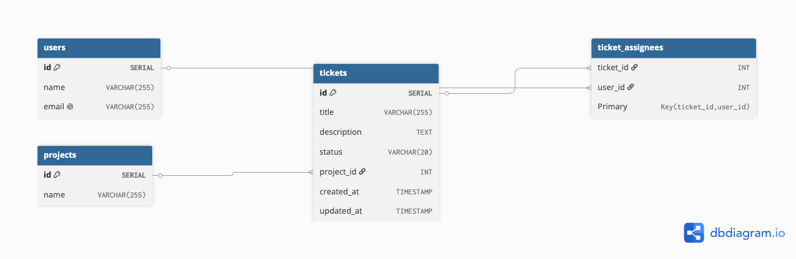

# **API Design Document — Ticket Tracking System**

# 1. Database diagram

Below is the ER diagram for the Ticket Tracking System:



**Relationships:**

- One **project** → many **tickets**
- Many **users** ↔ many **tickets** (via `ticket_assignees`)

# **2. Endpoint Summary**

| Method   | Path                                   | Description                                                                                    |
| -------- | -------------------------------------- | ---------------------------------------------------------------------------------------------- |
| **GET**  | /users                                 | List all users                                                                                 |
| GET      | /users/{id}                            | Get user by ID                                                                                 |
| POST     | /users                                 | Create a new user                                                                              |
| PUT      | /users/{id}                            | Update a user                                                                                  |
| DELETE   | /users/{id}                            | Delete a user                                                                                  |
| **GET**  | /projects                              | List projects with ticket counts                                                               |
| **POST** | /tickets                               | Create a new ticket                                                                            |
| GET      | /tickets                               | List of matching tickets. Empty`text` → return **all tickets**. Multiple filters use AND logic |
| GET      | /tickets/{id}                          | Get ticket by ID                                                                               |
| PUT      | /tickets/{id}                          | Update ticket                                                                                  |
| POST     | /tickets/{ticketId}/assignees/         | Assign user to ticket                                                                          |
| DELETE   | /tickets/{ticketId}/assignees/{userId} | Remove user from ticket                                                                        |

# **3. Endpoint description**

Below are the detailed descriptions for each endpoint.

## **POST /users**

Create a new user.

| Field             | Description                                             |
| ----------------- | ------------------------------------------------------- |
| **Endpoint**      | /users                                                  |
| **Method**        | POST                                                    |
| **Request body**  | `{ "name": "string", "email": "string" }`               |
| **Response body** | `{ "id": number, "name": "string", "email": "string" }` |
| **Validations**   | - name ≥ 3 chars - email valid - email unique           |

## **GET /users**

List all users.

| Field             | Description                                               |
| ----------------- | --------------------------------------------------------- |
| **Endpoint**      | /users                                                    |
| **Method**        | GET                                                       |
| **Request body**  | none                                                      |
| **Response body** | `[{ "id": number, "name": "string", "email": "string" }]` |
| **Validations**   | none                                                      |

## **GET /users/ {id}**

Retrieve a single user.

| Field             | Description                                             |
| ----------------- | ------------------------------------------------------- |
| **Endpoint**      | /users/{id}                                             |
| **Method**        | GET                                                     |
| **Response body** | `{ "id": number, "name": "string", "email": "string" }` |
| **Validations**   | - user must exist, valid ID                             |

## **PUT /users/ {id}**

Update a user.

| Field             | Description                                  |
| ----------------- | -------------------------------------------- |
| **Endpoint**      | /users/{id}                                  |
| **Method**        | PUT                                          |
| **Request body**  | `{ "name": "string", "email": "string" }`    |
| **Response body** | `{ "message": "User Updated" }               |
| **Validations**   | - name ≥ 3 chars - email valid - user exists |

## **DELETE /users/ {id}**

Delete a user.

| Field             | Description                     |
| ----------------- | ------------------------------- |
| **Endpoint**      | /users/{id}                     |
| **Method**        | DELETE                          |
| **Response body** | `{ "message": "User deleted" }` |
| **Validations**   | - user must exist               |

## **GET /projects**

List all projects with ticket counts.

| Field             | Description                                                                                       |
| ----------------- | ------------------------------------------------------------------------------------------------- |
| **Endpoint**      | /projects                                                                                         |
| **Method**        | GET                                                                                               |
| **Response body** | Example:`{ "id": 1, "name": "Website", "tickets": { "open": 10, "in_progress": 5, "closed": 30 }` |
| **Validations**   | none                                                                                              |

## **POST /tickets**

Create a new ticket.

| Field             | Description                                                                                                                          |
| ----------------- | ------------------------------------------------------------------------------------------------------------------------------------ |
| **Endpoint**      | /tickets                                                                                                                             |
| **Method**        | POST                                                                                                                                 |
| **Request body**  | `{ "title": "string", "description": "string", "projectId": number, "status": "open"}`                                               |
| **Response body** | { "id": number, "title":"string", "description":"string", "projectId": number, "status": "open",<br /><br />createdAt": "timestamp"} |
| **Validations**   | - Title required, Title  ≥ 3 chars ,  project must exists - status valid                                                             |

## **GET /tickets**

Search tickets.

GET /tickets?status=open&title=Bug&description=server

Use the Query String to search by title, description, or status. No filter returns all.

| Field             | Description                                                                                    |
| ----------------- | ---------------------------------------------------------------------------------------------- |
| **Endpoint**      | /tickets                                                                                       |
| **Method**        | GET                                                                                            |
| **Query params**  | `text` (search in title/description), `status:` ( open, in progress, closed)                   |
| **Response body** | List of matching tickets. Empty`text` → return **all tickets**. Multiple filters use AND logic |
| **Validations**   | -`status` must be one of: open, in progress, closed<br>- If provided, `text` must be a string  |

## **GET /tickets/ { { {id}**

Retrieve a single ticket.

| Field             | Description         |
| ----------------- | ------------------- |
| **Endpoint**      | /tickets/{id}       |
| **Method**        | GET                 |
| **Response body** | Full ticket details |
| **Validations**   | - ticket must exist |

## **PUT /tickets/ {id}**

Update ticket fields.

| Field             | Description                                                                             |
| ----------------- | --------------------------------------------------------------------------------------- |
| **Endpoint**      | /tickets/{id}                                                                           |
| **Method**        | PUT                                                                                     |
| **Request body**  | `{ "title": "string", "description": "string", "status": "type", "projectId": number }` |
| **Response body** | {**"message": "Ticket update successfully"**}                                           |
| **Validations**   | - status valid - project exists - ticket exists, email update automatically             |

## **POST /tickets/ {ticketId} /assignees/**

Assign a user to a ticket.

| Field             | Description                                               |
| ----------------- | --------------------------------------------------------- |
| **Endpoint**      | /ticket/{ticketId}/assignees/                             |
| Method            | POST<br />                                                |
| **Request body**  | { "userId" : number }                                     |
| **Response body** | {**"message": "User assigned successfully"**}             |
| **Validations**   | - ticket exists - user exists - user not already assigned |

## **DELETE /tickets/ {ticketd}/assign/ {userId}**

Remove a user from a ticket.

| Field             | Description                                                   |
| ----------------- | ------------------------------------------------------------- |
| **Endpoint**      | /tickets/{ticketId}/assignees/{userId}                        |
| **Method**        | DELETE                                                        |
| **Response body** | { "message": "User {userId} removed from ticket {ticketId}" } |
| **Validations**   | - ticket exists - user exists - user must be assigned         |

# **4. Email notifications**

**When is an email sent?**

- Ticket created — **No**
- Ticket updated — **No**
- User assigned to a ticket — **Yes**
- User removed from a ticket — **No**

**Logic**

Email notifications are only triggered when a new user is assigned to a ticket.
No emails are sent for ticket creation, ticket updates, or user removal.

### **Who receives it?**

- All assigned users of that ticket

### What does the email contain?\*\*

- Ticket ID
- Ticket title
- Ticket description
- List of assignees and Ticket status

Example:

Code

```
Ticket #123 updated:
Title: "Fix login bug"
Status: "In progress"
Assignees: Max, Dave
```

**What happens if sending fails?**

- The ticket update still succeeds
- The failure is logged
- Behavior follows **resend.com** API documentation
